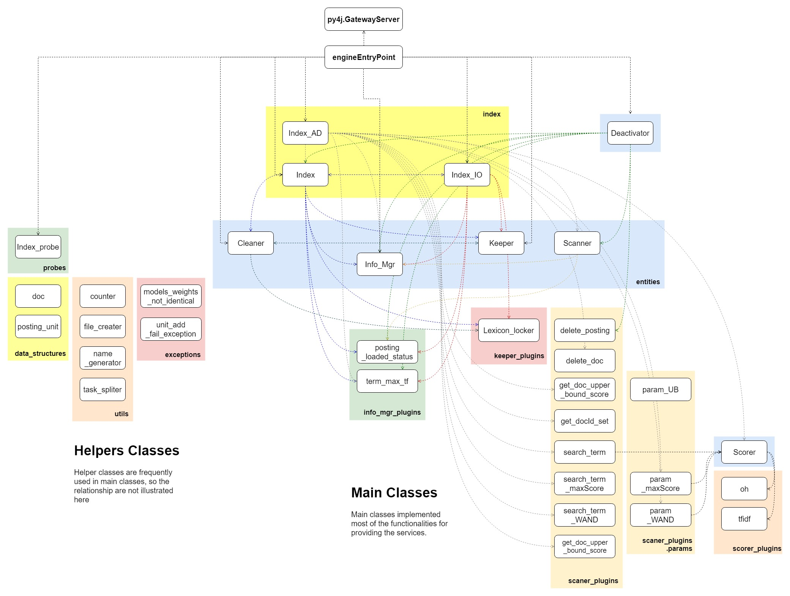

# toyEngine
The toyEngine is a implementation of the search engine invert-index, along with basic and advanced functionalities. Specifically this program is currently providing the **functionalities** as services including:  
1. persisting and loading of lexicon / last posting unit id / lexicon / term associated information;  
2. two layer lock service for terms;  
3. posting list persisting and lazily loading;  
4. posting unit lazily deleting and posting list cleaning;  
5. document adding and deleting;  
6. posting list accessing / visting status recording and automatically deactivating;  
7. reloading inverted index for reallocating post unit IDs;  
8. posting list scanning and two simple document scoring models;  
9. three searching algorithms including plain, maxScore, WAND;  
    
From the perspective of design, the program mainly consists of three parts,  
1. inverted-index and associated operations; 
2. entities supporting the implementations of the operations;  
3. helper classes like commonly used basic data structures and various utils.  
    
The design of entities are mostly applying the scheme of “**mainstay and plugins**”, in which specific functionalities and even data structures are provided and maintained by the plugins, this is for the convenience of developing additional functionalities based on the current backbone.  

What need to be noted is the index is currently using the py4j.GatewayServer to provide service.  
#### More details please refer to the documetation ...

